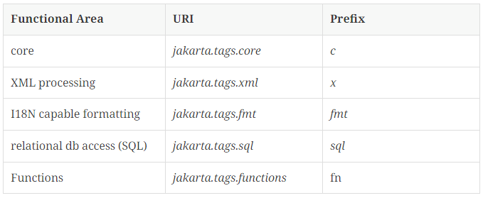

# EL & JSTL

## EL (Expression Language)

### EL

- EL 표현식은 JSP 내에 데이터를 다루는 데 사용되는 스크립팅 언어
- JSP 스크립트의 표현식 (`<%=  %>`)을 대신하여 속성값을 쉽게 출력할 수 있도록 고안된 언어
    
    스크립트 표현식 : `<%= expr %>`  EL : `${expr}`
    
- `${}` : 변수, 속성, 메서드 호출 등을 포함 할 수 있음
    
    ```java
    <body>
        <% out.print("HELLO"); %>
        <%= "HELLO" %>
        ${"HELLO"}
    </body>
    
    <body>
        문자열 : ${"HELLO"}<br>
        정수형 : ${10}<br>
        실수형 : ${10.1}<br>
        논리형 : ${true}<br>
        null : ${null}
    </body>
    ```
    

### JavaBeans

- JAVA로 작성된 재사용 가능한 소프트웨어 컴포넌트
- 관례
    - 클래스는 직렬화 되어야 한다.
    - 클래스는 기본생성자를 가지고 있어야 한다.
    - 클래스의 속성들은 getter, setter를 사용해 접근할 수 있어야 한다.
    - 클래스는 필요한 이벤트 처리 메서드들을 포함하고 있어야 한다.
- EL 표현식을 이용하여 접근이 가능하다.
    - `.(dot)` 혹은 `[”속성명”]`을 사용할 수 있다.
    - 인스턴스만을 작성하면 `toString()` 메서드가 동작한다.
    
    ```java
    <h2>JavaBeans</h2>
    <div>전체 정보 : ${p}</div>
    <div>이름 : ${p.name}</div>
    <div>나이 : ${p["age"]}</div>
    <div>취미 : ${p["hobbies"][0]}</div>
    ```
    

### 연산자
<table>
    <thead>
        <tr>
            <th>종류</th>
            <th>사용 가능 연산자</th>
        </tr>
    </thead>
    <tbody>
        <tr>
            <td>산술</td>
            <td>+, -, *, / (div), % (mod)</td>
        </tr>
        <tr>
            <td>관계</td>
            <td>== (eq), != (nq), < (lt), > (gt), <= (le), >= (ge)</td>
        </tr>
        <tr>
            <td>조건</td>
            <td>expr ? val1 : val2</td>
        </tr>
        <tr>
            <td>논리</td>
            <td>&& (and), || (or), ! (not)</td>
        </tr>
        <tr>
            <td>NULL</td>
            <td>empty</td>
        </tr>
    </tbody>
</table>

 - EL식은 연산자를 포함할 수 있으며, 산술 연산, 조건 연산, 논리 연산, 관계 연산을 수행할 수 있음
 - 일반적인 연산 이외에 null 연산을 수행할 수 있음
 - empty 연산자는 검사할 객체가 null인지 아닌지 검사하기 위해 사용 `${ empty name }`
    
    (null, “”, 요소가 없는 list, map, collection은 True)
    

### EL (Expression Language) 내장 객체
<table>
    <thead>
        <tr>
            <th>분류</th>
            <th>객체</th>
            <th>타입</th>
            <th>설명</th>
        </tr>
    </thead>
    <tbody>
        <tr>
            <td>JSP</td>
            <td>pageContext</td>
            <td>JavaBean</td>
            <td>현재 페이지의 page context instance</td>
        </tr>
        <tr>
            <td rowspan=4>Scope</td>
            <td>pageScope</td>
            <td>Map</td>
            <td>page 기본 객체에 저장된 속성을 저장하는 객체</td>
        </tr>
        <tr>
            <!-- <td></td> -->
            <td>requestScope</td>
            <td>Map</td>
            <td>request 기본 객체에 저장된 속성을 저장하는 객체</td>
        </tr>
        <tr>
            <!-- <td></td> -->
            <td>sessionScope</td>
            <td>Map</td>
            <td>session 기본 객체에 저장된 속성을 저장하는 객체</td>
        </tr>
        <tr>
            <!-- <td></td> -->
            <td>applicationScope</td>
            <td>Map</td>
            <td>application 기본 객체에 저장된 속성을 저장하는 객체</td>
        </tr>
        <tr>
            <td rowspan=2>요청 파라미터</td>
            <td>param</td>
            <td>Map</td>
            <td>JSP 내장 객체 request의 getParameter(name) 메서드와 동일한 역할을 함
            ${param.name} 또는 ${param["name"]}의 형태로 사용
            </td>
        </tr>
        <tr>
            <!-- <td></td> -->
            <td>paramValues</td>
            <td>Map</td>
            <td>JSP 내장 객체 request의 getParameterValues(name) 메서드와 동일한 역할</td>
        </tr>
        <tr>
            <td>쿠키</td>
            <td>cookie</td>
            <td>Map</td>
            <td>request 안에 있는 쿠키를 가져올수 있음</td>
        </tr>
        <tr>
            <td rowspan=2>요청헤더</td>
            <td>header</td>
            <td>Map</td>
            <td>request의 getHeader(name) 메서드와 동일한 역할</td>
        </tr>
        <tr>
            <!-- <td></td> -->
            <td>headerValues</td>
            <td>Map</td>
            <td>request의 getHeaders(name) 메서드와 동일한 역할</td>
        </tr>
    </tbody>
</table>


## JSTL (JSP Standard Tag Library)

### JSTL (JSP Standard Tag Library)

- JavaEE 기반의 웹 어플리케이션 개발을 위한 컴포넌트 모음
- JSP 스크립트와 html 코드가 섞여서 복잡한 구조를 가짐
    
    이를 간결하게 작성하기 위해서 자바코드를 태그 형태로 작성해 놓은 것
    
- 유용한 커스텀 태그들을 모아서 표준화 한 것

### JSTL 기능

- 간단한 프로그램 로직 구현 기능 - 변수 선언, if 문장, for 문장 등
- 데이터 출력 포맷 설정
- DB 입력, 수정, 삭제, 조회 기능
- 문자열 처리 함수
- XML 문서 처리

### JSTL 사용하기

[Jakarta Standard Tag Library](https://jakarta.ee/specifications/tags/3.0/jakarta-tags-spec-3.0)



- taglib 지시자를 이용한 태그 사용 선언
    
    `<%@ taglib prefix="c" uri="jakarta.tags.core" %>`
    
- 사용하고자 하는 기능에 따라 어떤 라이브러리를 사용할 지 작성한다 (ex: core)
- 사용할 태그를 구분하기 위해서 prefix를 작성해줌
    
    `<c:out value="Hello! JSTL"/>`
    
- prefix에 작성한 접두사를 적어주고, 기능에 따른 태그를 선택하여 작성

### JSTL - Core
<table>
    <thead>
        <tr>
            <th>기능 분류</th>
            <th>태그</th>
            <th>설명</th>
        </tr>
    </thead>
    <tbody>
        <tr>
            <td rowspan = 2>변수 지원</td>
            <td>set</td>
            <td>JSP에서 사용할 변수를 지정된 볌위의 속성으로 설정</td>
        </tr>
        <tr>
            <!-- <td></td> -->
            <td>remove</td>
            <td>설정한 변수를 제거</td>
        </tr>
        <tr>
            <td rowspan=4>흐름제어</td>
            <td>if (else는 없음)</td>
            <td>조건에 따라 내부 코드를 수행</td>
        </tr>
        <tr>
            <!-- <td></td> -->
            <td>choose</td>
            <td>다중 조건을 처리할 때 사용 [when(if) | other wise(else)]</td>
        </tr>
        <tr>
            <!-- <td></td> -->
            <td>forEach</td>
            <td>컬렉션의 각 항목에 대해 반복을 처리할 때 사용</td>
        </tr>
        <tr>
            <!-- <td></td> -->
            <td>for Tokens</td>
            <td>구분자로 분리된 각각의 토큰을 처리할 때 사용</td>
        </tr>
        <tr>
            <td rowspan=3>URL 처리</td>
            <td>import</td>
            <td>URL을 사용하여 다른 자원의 결과를 삽입</td>
        </tr>
        <tr>
            <!-- <td></td> -->
            <td>redirect</td>
            <td>지정한 경로로 리다이렉트</td>
        </tr>
        <tr>
            <!-- <td></td> -->
            <td>url</td>
            <td>URL을 재작성</td>
        </tr>
        <tr>
            <td rowspan=2>기타 태그</td>
            <td>catch</td>
            <td>예외 처리에 사용</td>
        </tr>
        <tr>
            <!-- <td></td> -->
            <td>out</td>
            <td>변수나 표현식의 결과를 HTML 출력에 쓸 때 사용</td>
        </tr>
    </tbody>
</table>