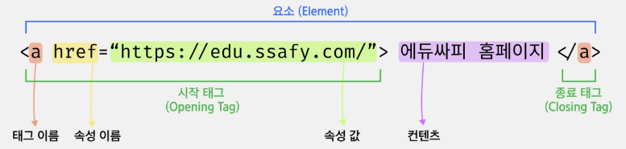

# HTML

# Web

- HTML - 구조
- CSS - 꾸밈, 스타일링
- JS - 동작

### 웹과 브라우저

- 웹 사이트는 브라우저를 통해 동작
- 브라우저마다 동작이 조금씩 달라서 실행에 문제가 생기는 경우가 있음

### 웹 표준

- 웹에서 사용되는 표준 기술이나 규칙
- 브라우저 종류에 관계없이 동일하게 보이도록 가이드 제공

### 크롬 개발자 도구 - Chrome Developer Tools

- 개발과 관련된 다양한 기능
- 크롬 브라우저 우측 상단
- Elements, Sources, Network, Performance, Application 등을 활용
- `ctrl + shift + i`

# HTML 개념

### Hyper Text Markup Language

- Hyper Text : 참조를 통해 한 문서에서 다른 문서로 즉시 접근할 수 있는 텍스트
- Markup : **태그(Tag)** 등을 이용하여 문서나 데이터의 구조를 정의하는 언어
    - Markdown → **기호**를 이용하여 문서의 구조 정의
- Markdown : Markup 언어의 일종으로 기호를 활용한 읽기와 쓰기 간단한 언어.md 확장자 파일

### HTML

- 웹 페이지를 작성하기 위한 언어
- .html 확장자를 가짐
- 태그(Tag)는 대소문자 구분이 없음 (but 소문자 추천)
- `Enter`  `tab` `space` 적용되지 않음
- 마크업 스타일
    - 1 indent == `2 space bar`

# HTML 구성 요소

## 기본 구조

`<!DOCTYPE>`

- HTML 문서가 따라야 할 일종의 오랜 약속이나 작성하지 않아도 잘 작동함

`<html></html>`

- HTML 최상위 요소로 페이지 전체의 컨텐츠를 감싸는 루트(root) 요소
- 문서내에서 사용할 문자코드를 lang 속성에 지정

`<head></head>`

- HTML 문서에 표현하고 싶은 구성 요소 외의 재료들을 담고 있는 공간
- **페이지 이름, CSS, favicon** 등을 작성
- **브라우저 화면에 출력되지 않음**

`<meta>`

- 문서의 작성자, 날짜 등 화면에 출력되지 않는 일반 정보들
- charset = “utf - 8” : HTML 문서가 사용할 문서 형태 지정
- name = “viewport” content-width = “device-width”
    - 문서에 너비를 보장해주어 흘러 넘치지 않게 함

`<title></title>`

- HTML 문서의 제목으로 브라우저 탭에 표시됨

`<body></body>`

- 브라우저 화면에 나타나는 정보로 HTML문서에 보여줄 모든 요소를 작성하는 공간
- id 속성을 이용해서 문서 내에 tag 식별 가능 (중복 X)
- class 속성을 이용하여 여러 tag에 공통적인 특성 부여 (중복 O)

## 요소와 태그

HTML의 요소는 태그와 내용으로 구성



- 시작태그/ 종료 태그로 쌍을 이루거나 시작태그만 존재하는 경우도 있음
- 각각의 시작태그는 속성을 가질 수 있음

### 요소 중첩

```html
<p> You can call me <strong>Kyu</strong>.</p>
<span>Like a<b>magic</b>.<i>-Hong Gyun-</i></span>
```

### 닫는 태그의 생략 - 빈 요소

```html

```

### 주석

- 주석의 내용은 브라우저에 출력되지 않음
- HTML  Tag의 내용을 설명하기 위한 용도로 사용
- `<!-- HTML 주석 내용 -->` `ctrl + /`
- 주석은 중첩X

### 특수문자

`공백 2개 -> &ensp;` `공백 3개 -> emsp;`

| 표현문자 | HTML 문자 표현 | 설명 |
| --- | --- | --- |
|  (공백) | \&nbsp; | Non-breaking space |
| < | \&lt; | Less than |
| > | \&gt; | Greater than |
| & | \&amp; | Ampersand |
| “ | \&quot; | Quotation mark |
| ⓒ | \&copy; | Copyright |
| ® | \&reg; | Registered Trademark |
| ± | \&plusmn; | Plus or minus |

## Semantic Tag

- 의미론적 요소를 담은 태그

| 태그 이름 | 설명 |
| --- | --- |
| \<header> | 문서의 시작 |
| \<nav> | 네비게이션 |
| \<aside> | 사이드에 위치한 공간 |
| \<section> | 문서의 일반적인 구분 |
| \<article> | 문서, 페이지, 사이트 안에서 독립적으로 구분되는 영역 |
| \<footer> | 문서의 끝 |
| \<h1>~\<h6> | 제목 |
- 코드의 **가독성을 높이고 유지보수를 쉽게** 할 수 있음
- 다양한 형식으로 활용 가능하며 정석/ 정답은 없음

### Semantic Tag

- 브라우저에 표시되는 정보를 태그로 표현
- 단순히 구역을 나누는 것 뿐만 아니라, 구조를 나누는 데에 의미가 필요
- 요소의 의미가 확실하기 대문에 코드의 가독성 뿐만 아니라 유지보수가 용이
- 정석은 없음

### DOM (Document Object Model) 트리

- HTML 문서를 브라우저에 렌더링 하기 위한 구조
    - 조상관계 - ancestor
    - 자손관계 - descendant
    - 부모관계 - parent children
    - 형제 관계 - sibling

### Block / Inline Text Content

- Block Text Content
    - 블록 레벨 요소는 언제나 새로운 줄에서 시작하고, 좌우 양쪽으로 최대한 늘어나 가능한 모든 너비를 차지

| 태그 이름 | 설명 |
| --- | --- |
| \<blockquote> | 긴 인용문, 주로 들여쓰기를 한 것으로 그려 짐 |
| \<hr> | 구분선 |
| \<pre> | 공백, 줄 바꿈 등 입력된 그대로 화면에 표시 |
| \<p> | 하나의 문단 |
| \<ul> | 정렬되지 않은 목록(번호 X) |
| \<ol> | 정렬된 목록(번호 O) |
| \<li> | 목록의 자식 요소 |
| \<div> | 구문 컨텐츠를 위한 블록 컨테이너 |
- Inline Text Content
    - 인라인 요소는 새로운 줄을 만들지 않으며 필요한 너비만 차지

| 태그 이름 | 설명 |
| --- | --- |
| \<a> | href 속성을 통해 지정된 경로를 연결하는 하이퍼링크 생성 (Hyper Text) |
| \<span> | 구문 콘텐츠를 위한 인라인 컨테이너 (normal Text) |
| \<b>, \<strong> | 굵게 함, 중대하거나 긴급한 컨텐츠 (strong) |
| \<i>, \<em> | 기울임, 특정 문자 강조(em) |
| \<s> | 취소선 |
| \<u> | 밑줄 |
| \<q> | 짧은 인라인 인용문 |
| \<sup>,\<sub> | 위 첨자, 아래 첨자 |
| \<br> | 텍스트 안에 줄 바꿈을 생성 |

### Image&Multimedia

| 태그 이름 | 설명 |
| --- | --- |
| \<audio> | 소리 콘텐츠를 포함할 때 사용 |
| \ | 문서에 이미지 삽입  |
| \<video> | 미디어 플레이어를 문서에 삽입 |

## Table Content

| 태그 이름 | 설명 |
| --- | --- |
| \<table> | 행과 열로 이루어진 표 |
| \<thead> | 테이블 열의 머리글인 행들의 집합 |
| \<tbody> | 표의 여러 행을 묶어서 표 본문 구성 |
| \<tfoot> | 테이블의 열을 요약하는 행들의 집합 |
| \<tr> | 테이블 행 |
| \<th>, \<td> | 머리글, 데이터 |
| \<col> | 표의 열을 나타냄 |
| \<colgroup> | 표의 열을 묶는 그룹 정의 |
| \<caption> | 표의 설명 또는 제목을 나타냄 |

## Form

- 사용자로부터 데이터를 입력 받아 서버에 처리하기 위한 용도로 사용
- 사용자가 작성한 데이터를 서버로 전송 (submit)
<table>
  <tr>
    <th>속성</th>
    <th>설명</th>
  </tr>
  <tr>
    <td rowspan="3">method (GET)</td>
    <td>주소 표시줄에 사용자가 입력한 내용이 표시 256~2048Bytes(길이 제한)의 데이터만 서버로 전송 → 보안에 취약 </td>
  </tr>
  <tr>
    <!-- <td></td> -->
    <td>• parameter가 url에 노출</td>
  </tr>
  <tr>
    <!-- <td></td> -->
    <td>• queryString에 담겨서 전송</td>
  </tr>
  <tr>
    <td>method (POST)</td>
    <td> HTTP 메세지의 Body에 담아서 전송해서 내용의 길이에 제한이 없음. 사용자가 입력한 내용이 표시되지 않음</td>
  </tr>
  <tr>
    <td>name</td>
    <td>form의 이름을 지정</td>
  </tr>
  <tr>
    <td>action</td>
    <td> `form` 태그 안의 내용들을 처리해줄 서버 상의 프로그램 지정 (URL) → 어디에 보낼 지 경로 지정</td>
  </tr>
  <tr>
    <td>target</td>
    <td> `action` 태그에 지정한 스크립트 파일을 현재 창이 아닌 다른 위치에 열도록 지정</td>
  </tr>  
</table>

| 태그 이름 | 설명 |
| --- | --- |
| \<form> | 정보를 제출하기 위한 대화형 컨트롤러를 포함하는 문구 구획을 나타냄 |
| \<label> | 사용자 인터페이스 항목의 설명을 나타냄 |
| \<input> | 웹 기반 양식에서 사용자의 데이터를 받을 수 있는 대화형 컨트롤 |
| \<button> | 클릭 가능한 버튼을 나타냄 |
| \<select> | 옵션 메뉴를 제공하는 컨트롤을 나타냄 |
| \<option> | 항목 |
| \<fieldset> | 웹 양식의 여러 컨트롤과 레이블을 묶을 때 사용 |
| \<legend> | fieldset 콘텐츠의 설명을 나타냄 |
| \<textarea> | 멀티라인 일반 텍스트 편집 컨트롤을 나타냄 |

## Input

- 요소의 동작은 type 속성에 따라 달라짐
<table>
  <tr>
    <th>속성</th>
    <th>설명</th>
  </tr>
  <tr>
    <td>autofocus</td>
    <td>페이지 로딩 후 폼의 요소 중에서 해당 요소에 마우스 커서를 표시</td>
  </tr>
  <tr>
    <td rowspan="2">placeholder</td>
    <td>텍스트를 입력할 때 도움이 되도록 입력란에 적당한 힌트 내용을 표시</td>
  </tr>
  <tr>
    <!-- <td></td> -->
    <td>클릭 시 자동으로 내용이 사라짐</td>
  </tr>
  <tr>
    <td rowspan="2">readonly</td>
    <td>입력란에 텍스트를 사용자가 직접 입력하지 못하게 읽기 전용으로 지정</td>
  </tr>
  <tr>
    <!-- <td></td> -->
    <td>readonly, readonly="readonly", readonly="true"로 표현</td>
  </tr>
  <tr>
    <td rowspan="2">required</td>
    <td>form에 daa를 입력한 후 submit 클릭 시 data를 서버로 전송하기 전 필수 입력 항목을 체크</td>
  </tr>
  <tr>
    <!-- <td></td> -->
    <td>required, required=required로 표현</td>
  </tr>
  <tr>
    <td rowspan="2">min, max, step</td>
    <td>min, max는 해당 필드의 최대, 최소값 지정. step은 일정 가격 지정</td>
  </tr>
  <tr>
    <!-- <td></td> -->
    <td>type이 date, datetime, datetime-local, month, week, time, number, range에서 사용</td>
  </tr>
  <tr>
    <td>size</td>
    <td>화면에 보여지는 글자의 길이 지정</td>
  </tr>
  <tr>
    <td>minlength, maxlength</td>
    <td>텍스트 입력 시 최대, 최소길이 지정</td>
  </tr>
  <tr>
    <td>height, width</td>
    <td>type="image"일 때 이미지의 너비와 높이를 지정</td>
  </tr>
  <tr>
    <td>multiple</td>
    <td>type="email"이나 type="file"일 때 두 개 이상의 값을 입력. `input` 태그 안에 속성 이름만 표시하면 됨</td>
  </tr>
</table>