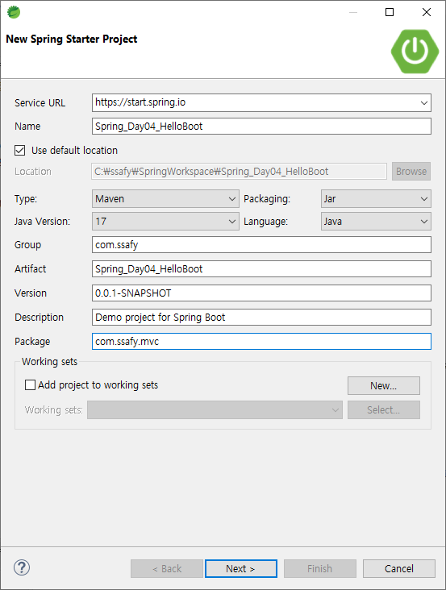
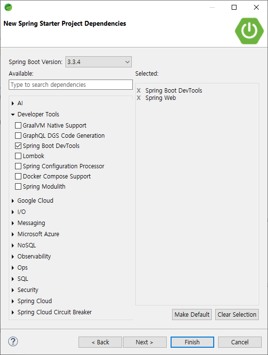
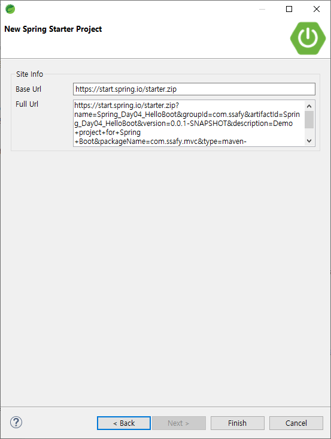

# Spring Boot

## Spring Boot

### Spring Boot의 등장

- 스프링을 더욱 편리하게 사용할 수 있게 만들어 줌 (간결한 설정)
- 호환이 가능한 라이브러리에 대한 버전을 가지고 있음
- “Just run” 할 수 있는 독립형, 프로덕션 등급의 스프링 기반의 어플리케이션을 쉽게 생성할 수 있음

### Spring Boot 특징

- **독립 실행형 스프링 어플리케이션 생성**
- **Tomcat**을 내장하고 있어, WAR 파일을 배포할 필요가 없음
- ‘starter’ 종속성을 제공하여 빌드 구성을 단순화 함
- 스프링, 3rd-파티 라이브러리의 버전을 자동으로 관리
- 상태 확인 기능 제공
- XML에 대한 요구사항 없음

## Spring Boot Project

### Spring Boot Project 생성

1. Spring Boot Project 생성
2. Spring Boot Project 의존성 추가
    - ADD DEPENDENCIES 클릭하여 의존성 추가 가능
3. Spring Boot Project Import
    - Existing Maven Projects
    - 압축 해제 폴더 선택 후 Finish
4. Spring Boot Project 생성 (STS)
    <figure class="thrid">
      
      
      
    </figure>

    - Spring Starter Project를 통해 생성 가능
    - 프로젝트 명/ Type, Packaging 등 설정 후 Next
    - 의존성 추가/ Spring Boot DevTools (변경 시 자동 재시작 등)/ Spring Web MVC를 사용하기 위하여 추가/ Next or Finish

### Spring Boot Project 구조

| 프로젝트 구조 | 설명 |
| --- | --- |
| src/main/java | Java 코드를 작성하는 폴더 |
| src/main/resources | 어플리케이션의 리소스 파일을 저장하는 폴더 |
| static | CSS, JavaScript, Image 등 정적 파일 저장하는 폴더 |
| templates | 동적으로 생성되는 HTML 템플릿을 저장하는 폴더 (Thymeleaf, FreeMaker 등) |
| application.properties | 어플리케이션의 설정파일 |
| src/test/java | 테스트 코드를 저장하는 폴더 |
| HelloSpringBootApplication.java | 어플리케이션을 시작할 수 있는 main method가 존재하는 클래스 |
| HelloSpringBootApplicationTests.java | JUnit Test 클래스 |
| target | Maven 빌드 시 결과물이 저장되는 폴더 |
| HELP.md | Spring Boot 도움말 |
| mvnw, mvnw.cmd | Maven Wrapper의 실행 스크립트 |
| pom.xml | Maven 프로젝트의 설정파일 |

### Spring Boot Project 실행

- static 폴더에 index.html 생성
- Spring Boot에서는 기본으로 static/index.html을 Welcome Page로 읽으려고 한다.
- 프로젝트 → 우 클릭 → Run As → Spring Boot App으로 실행
- main 메서드 실행

## Spring Boot JSP

### Spring Boot 간단한 MVC

- application.properties에 ViewResolver 설정 등록
    
    ```xml
    spring.application.name=HelloSpringBoot
    
    # JSP PATH
    spring.mvc.view.prefix=/WEB-INF/views/
    spring.mvc.view.suffix=.jsp
    ```
    
- Spring Boot Bean 확인
    
    ```java
    @SpringBootApplication
    public class HelloSpringBootApplication{
    	public static void main(String[] args) {
    		ApplicationContext context = SpringApplication.run(~.class, args);
    		
    		for(String name : context.getBeanDefinitionNames())
    			System.out.println(name);
    ```
