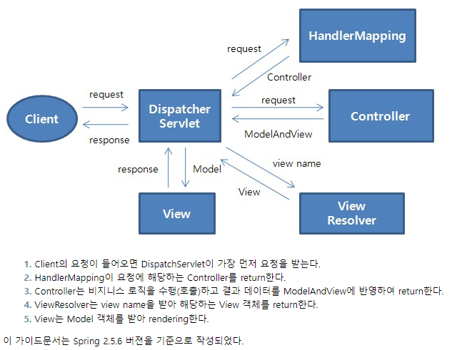

# Spring MVC

## MVC 패턴

### Model

- 동작을 수행하는 코드
- 사용자 View에 어떻게 보일지에 대해서 신경x
- 데이터 질의에 대한 정보를 제공하는 기능 및 데이터에 대한 수정을 담당

### View

- 사용자가 화면에 무엇을 어떻게 볼 것인지를 결정
- 사용자 화면에 보이는 부분
- 모델의 정보를 받아와 사용자에게 보여주는 역할 수행
- 자체적으로 모델의 정보를 보관X

### Contoller

- 요청을 받아 검증하고 비즈니스 로직을 수행
- 모델과 뷰를 연결하는 역할을 수행
- 사용자에게 데이터를 가져오고 수정하고 제공함

## Spring Web MVC

### Spring Web MVC

- Servlet API를 기반으로 구축된 **Web Framework**
- 정식 명칭은 Spring Web MVC이지만, Spring MVC로 주로 알려져 있음
- Spring Framework가 제공하는 DI, AOP 뿐 아니라, WEB 개발을 위한 기능을 제공
- **`DispatcherServlet`**(Front-Controller)를 중심으로 디자인 되었으며, `View Resolver`, `Handler Mapping`, `Controller`와 같은 객체와 함께 요청을 처리하도록 구성됨

### Spring MVC 구성요소

- `DispatcherServlet` → 클라이언트 **요청**처리 (요청 및 처리 결과 전달)
- `HandlerMapping` → 요청을 **어떤 Controller**가 처리할 지 결정
- `Controller` → 요청에 따라 수행할 메서드를 선언하고, 요청 처리를 위한 로직 수행 (비즈니스 로직 호출)
- `ModelAndView` → 요청처리를 하기 위해서 필요한 혹은 그 결과를 저장하기 위한 객체
- `ViewResolver` → Controller에 선언된 view 이름을 기반으로 결과를 반환할 View를 결정
- `View` → 응답화면 생성

### Spring MVC - 요청 처리 흐름



[https://www.egovframe.go.kr/wiki/doku.php?id=egovframework:rte2:ptl:spring_mvc_architecture](https://www.egovframe.go.kr/wiki/doku.php?id=egovframework:rte2:ptl:spring_mvc_architecture)

### Spring MVC (DispatcherServlet)

- 컨테이너 구성
    - DispatcherServlet
        - Servlet WebApplicationContext.xml (Web 관련이 직접적으로 있는 설정)
            - Controllers
            - ViewResolver
            - HandlerMapping
        - Root WebApplicationContext.xml (Web과 관련이 없는 설정)
            - Services
            - Repositories

### Spring Web MVC 구성하기

- DispatcherServlet 등록
    - **web.xml 등록** → 내가 만든 것과 다른 사람이 만든 것 모두 등록 가능
    - @WebServlet("") → 내가 만든 것만 등록 가능
- servlet-context.xml / root-context.xml 파일 생성
    
    ```xml
    [web.xml]
    
    <!-- DispatcherServlet 등록-->
    <servlet>
      <servlet-name>springDispatcherServlet</servlet-name>
      <servlet-class>org.springframework.web.servlet.DispatcherServlet</servlet-class>
      <init-param>
        <param-name>contextConfigLocation</param-name>
        <param-value>/WEB-INF/servlet-context.xml</param-value>
      </init-param>
      <load-on-startup>1</load-on-startup>
    </servlet>
    <servlet-mapping>
      <servlet-name>springDispatcherServlet</servlet-name>
      <url-pattern>/<url-pattern>
    </servlet-mapping>
    
    <!-- root-context.xml 설정 추가-->
    <listener>
      <listener-class>org.springframework.web.context.ContextLoaderListener</listener-class>
    </listener>
    
    <context-param>
      <param-name>contextConfigLocation</param-name>
      <param-value>/WEB-INF/root-context.xml</param-value>
    </context-param>
    ```
    
- servlet-context.xml 작성
    
    ```xml
    [servlet-context.xml]
    
    <!-- 뷰 리졸버 등록-->
    <bean class="org.springframework.web.servlet.view.InternalResourceViewResolver">
      <property name="prefix" value="/WEB-INF/view/"></property>
      <property name="suffix" value=".jsp"></property>
    </bean>
    <!-- DefaultAnnotationHandlerMapping을 기본으로 사용하므로 별도 등록 없이 사용가능 (spring 3.0)-->
    ```
    
- Controller 작성 (Component-Scan 빈 등록)
    
    ```java
    @Controller
    public class MyController{
      
      @RequestMapping("/")
      public String index(){
        return "index";
      }
    }
    ```
    

### RequestMapping

- URL을 클래스 또는 특정 핸들러(메서드)에 매핑
- 메서드 Annotation은 요청 방식(GET, POST) 등으로 범위를 좁혀준다.
    
    ```java
    @RequestMapping(value="home", method=RequestMethod.GET)
    public ModelAndView homeHandle1() {
      ModelAndView mav = new ModelAndView();
      // 키, 밸류 형태로 넣음
      mav.addObject("msg", "Spring MVC (GET)");
      // View 이름 지정해주고 넘기기, 포워딩 한 것과 동일
      mav.setViewName("home");
      return mav;
    }
    
    @RequestMapping(value="home", method=RequestMethod.POST)
    public ModelAndView homeHandle2() {
      ModelAndView mav = new ModelAndView();
      // 키, 밸류 형태로 넣음
      mav.addObject("msg", "Spring MVC (POST)");
      // View 이름 지정해주고 넘기기, 포워딩 한 것과 동일
      mav.setViewName("home");
      return mav;
    }
    ```
    

### Controller Parameter

<table>
  <tr>
    <th>파라미터 타입</th>
    <th>설명</th>
  </tr>
  <tr>
    <td>HttpServletRequest</td>
    <td rowspan="3">Servlet API를 사용할 수 있다.</td>
  </tr>
  <tr>
    <td>HttpServletResponse</td>
    <!-- <td></td> -->
  </tr>
  <tr>
    <td>HttpSession</td>
    <!-- <td></td> -->
  </tr>
  <tr>
    <td>Locale</td>
    <td>요청 클라이언트의 Locale 정보를 포함</td>
  </tr>
  <tr>
    <td>InputStream, Reader</td>
    <td rowspan="2">요청으로부터 직접 데이터를 읽어오거나, 응답을 직접 생성하기 위해서 사용</td>
  </tr>
  <tr>
    <td>OutputStream, Writer</td>
    <!-- <td></td> -->
  </tr>
  <tr>
    <td>Map, Model, ModelMap</td>
    <td>View 데이터를 전달하기 위해서 사용</td>
  </tr>
  <tr>
    <td>RedirectAttributes</td>
    <td>리다이렉션(쿼리 문자열에 추가)시 사용할 속성 지정</td>
  </tr>
  <tr>
    <td>Errors, BindingResult</td>
    <td>에러와 데이터 바인딩 결과에 접근하기 위해서 사용</td>
  </tr>
  <tr>
    <td>@PathVariable</td>
    <td>URI 템플릿 변수에 대한 엑세스</td>
  </tr>
  <tr>
    <td>@RequestParam</td>
    <td>multipart 파일을 포함하여 요청 파라미터에 액세스</td>
  </tr>
  <tr>
    <td>@RequestHeader</td>
    <td>요청 헤더에 액세스</td>
  </tr>
  <tr>
    <td>@CookieValue</td>
    <td>쿠키에 대한 액세스</td>
  </tr>
  <tr>
    <td>@RequestAttribute</td>
    <td rowspan="2">모든 속성/ 세션 속성에 대한 액세스</td>
  </tr>
  <tr>
    <td>@SessionAttribute</td>
    <!-- <td></td> -->
  </tr>
  <tr>
    <td>@ModelAttribute</td>
    <td>모델의 속성에 액세스</td>
  </tr>
</table>

### Controller Return Type
<table>
  <tr>
    <th>파라미터 타입</th>
    <th>설명</th>
  </tr>
  <tr>
    <td>@ResponseBody</td>
    <td>HttpMessageConverter 구현을 통해 변환되어 응답</td>
  </tr>
  <tr>
    <td>HttpHeaders</td>
    <td>헤더가 있고 body가 없는 response를 반환</td>
  </tr>
  <tr>
    <td>String</td>
    <td>뷰 이름 반환(ViewResolver 선언과 함께 사용)</td>
  </tr>
  <tr>
    <td>View</td>
    <td>랜더링 하는데 사용할 View 인스턴스</td>
  </tr>
  <tr>
    <td>Map, Model</td>
    <td>명시적으로 모델을 작성하지 않은 겨우 사용</td>
  </tr>
  <tr>
    <td>ModelAndView</td>
    <td>사용할 view와 속성을 포함하는 객체</td>
  </tr>
  <tr>
    <td>@ModelAttribute</td>
    <td>모델의 속성에 액세스</td>
  </tr>
  <tr>
    <td rowspan="2">void</td>
    <td>method에 ServletResponse, HttpServletResponse인자가 있는 경우,</td>
  </tr>
  <tr>
    <!-- <td></td> -->
    <td>모든 요청이 처리된 것으로 간주, 그렇지 않으면 요청 URI를 view name으로 처리</td>
  </tr>
</table>
